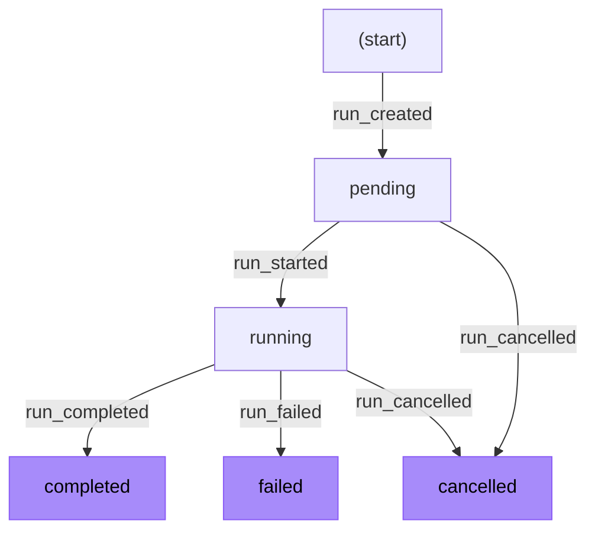
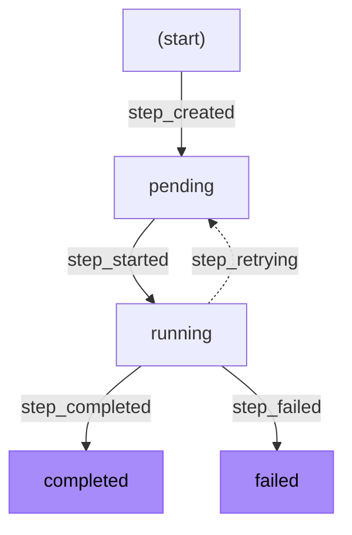
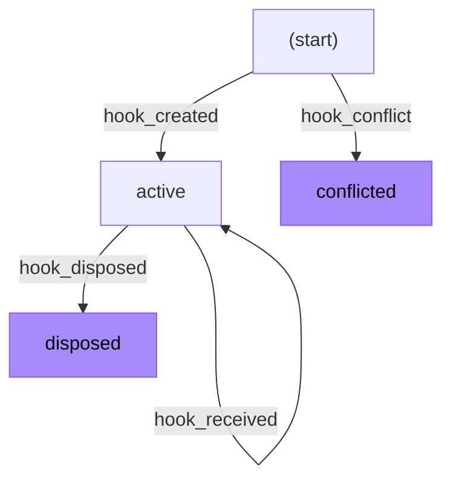
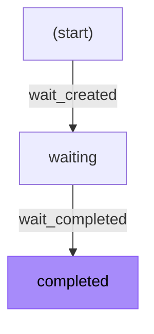

<Callout>
This guide explores how the Workflow DevKit uses event sourcing internally. Understanding these concepts is helpful for debugging and building observability tools, but is not required to use workflows. For getting started with workflows, see the [getting started](/docs/getting-started) guides for your framework.
</Callout>

The Workflow DevKit uses event sourcing to track all state changes in workflow executions. Every mutation creates an event that is persisted to the event log, and entity state is derived by replaying these events.

This page explains the event sourcing model and entity lifecycles.

## Event Sourcing Overview

Event sourcing is a persistence pattern where state changes are stored as a sequence of events rather than by updating records in place. The current state of any entity is reconstructed by replaying its events from the beginning.

**Benefits for durable workflows:**

- **Complete audit trail**: Every state change is recorded with its timestamp and context
- **Debugging**: Replay the exact sequence of events that led to any state
- **Consistency**: Events provide a single source of truth for all entity state
- **Recoverability**: State can be reconstructed from the event log after failures

In the Workflow DevKit, the following entity types are managed through events:

- **Runs**: Workflow execution instances (materialized in storage)
- **Steps**: Individual atomic operations within a workflow (materialized in storage)
- **Hooks**: Suspension points that can receive external data (materialized in storage)
- **Waits**: Sleep or delay operations (materialized in storage)

## Entity Lifecycles

Each entity type follows a specific lifecycle defined by the events that can affect it. Events transition entities between states, and certain states are terminal—once reached, no further transitions are possible.

<Callout type="info">
In the diagrams below, purple nodes indicate terminal states that cannot be transitioned out of.
</Callout>

### Run Lifecycle

A run represents a single execution of a workflow function. Runs begin in `pending` state when created, transition to `running` when execution starts, and end in one of three terminal states.

**Run states:**

- `pending`: Created but not yet executing
- `running`: Actively executing workflow code
- `completed`: Finished successfully with an output value
- `failed`: Terminated due to an unrecoverable error
- `cancelled`: Explicitly cancelled by the user or system

### Step Lifecycle

A step represents a single invocation of a step function. Steps can retry on failure, either transitioning back to `pending` via `step_retrying` or being re-executed directly with another `step_started` event.

**Step states:**

- `pending`: Created but not yet executing, or waiting to retry
- `running`: Actively executing step code
- `completed`: Finished successfully with a result value
- `failed`: Terminated after exhausting all retry attempts
- `cancelled`: Reserved for future use (not currently emitted)

<Callout type="info">
The `step_retrying` event is optional. Steps can retry without it - the retry mechanism works regardless of whether this event is emitted. You may see back-to-back `step_started` events in logs when a step retries after a timeout or when the error is not explicitly captured. See [Errors and Retries](/docs/foundations/errors-and-retries) for more on how retries work.
</Callout>

When present, the `step_retrying` event moves a step back to `pending` state and records the error that caused the retry. This provides two benefits:

- **Cleaner observability**: The event log explicitly shows retry transitions rather than consecutive `step_started` events
- **Error history**: The error that triggered the retry is preserved for debugging

### Hook Lifecycle

A hook represents a suspension point that can receive external data, created by [`createHook()`](/docs/api-reference/workflow/create-hook). Hooks enable workflows to pause and wait for external events, user interactions, or HTTP requests. Webhooks (created with [`createWebhook()`](/docs/api-reference/workflow/create-webhook)) are a higher-level abstraction built on hooks that adds automatic HTTP request/response handling.

Hooks can receive multiple payloads while active and are disposed when no longer needed.

**Hook states:**

- `active`: Ready to receive payloads (hook exists in storage)
- `disposed`: No longer accepting payloads (hook is deleted from storage)
- `conflicted`: Hook creation failed because the token is already in use by another workflow

Unlike other entities, hooks don't have a `status` field—the states above are conceptual. An "active" hook is one that exists in storage, while "disposed" means the hook has been deleted. When a `hook_disposed` event is created, the hook record is removed rather than updated.

While a hook is active, its token is reserved and cannot be used by other workflows. If a workflow attempts to create a hook with a token that is already in use by another active hook, a `hook_conflict` event is recorded instead of `hook_created`. This causes the hook's promise to reject with a `WorkflowRuntimeError`, failing the workflow gracefully. See the [hook-conflict error](/docs/errors/hook-conflict) documentation for more details.

When a hook is disposed (either explicitly or when its workflow completes), the token is released and can be claimed by future workflows. Hooks are automatically disposed when a workflow reaches a terminal state (`completed`, `failed`, or `cancelled`). The `hook_disposed` event is only needed for explicit disposal before workflow completion.

See [Hooks & Webhooks](/docs/foundations/hooks) for more on how hooks and webhooks work.

### Wait Lifecycle

A wait represents a sleep operation created by [`sleep()`](/docs/api-reference/workflow/sleep). Waits track when a delay period has elapsed.

**Wait states:**

- `waiting`: Delay period has not yet elapsed
- `completed`: Delay period has elapsed, workflow can resume

<Callout type="info">
Like Runs, Steps, and Hooks, waits are materialized as entities in storage. When a `wait_created` event is processed, a wait entity is created with status `waiting`. When a `wait_completed` event is processed, the wait entity is atomically transitioned to `completed` — this guarantees that a wait can only be completed exactly once, even if multiple concurrent invocations attempt to complete it simultaneously.
</Callout>

## Event Types Reference

Events are categorized by the entity type they affect. Each event contains metadata including a timestamp and a `correlationId` that links the event to a specific entity:

- Step events use the `stepId` as the correlation ID
- Hook events use the `hookId` as the correlation ID
- Wait events use the `waitId` as the correlation ID
- Run events do not require a correlation ID since the `runId` itself identifies the entity

### Run Events

| Event | Description |
|-------|-------------|
| `run_created` | Creates a new workflow run in `pending` state. Contains the deployment ID, workflow name, input arguments, and optional execution context. |
| `run_started` | Transitions the run to `running` state when execution begins. |
| `run_completed` | Transitions the run to `completed` state with the workflow's return value. |
| `run_failed` | Transitions the run to `failed` state with error details and optional error code. |
| `run_cancelled` | Transitions the run to `cancelled` state. Can be triggered from `pending` or `running` states. |

### Step Events

| Event | Description |
|-------|-------------|
| `step_created` | Creates a new step in `pending` state. Contains the step name and serialized input arguments. |
| `step_started` | Transitions the step to `running` state. Includes the current attempt number for retries. |
| `step_completed` | Transitions the step to `completed` state with the step's return value. |
| `step_failed` | Transitions the step to `failed` state with error details. The step will not be retried. |
| `step_retrying` | (Optional) Transitions the step back to `pending` state for retry. Contains the error that caused the retry and optional delay before the next attempt. When not emitted, retries appear as consecutive `step_started` events. |

### Hook Events

| Event | Description |
|-------|-------------|
| `hook_created` | Creates a new hook in `active` state. Contains the hook token and optional metadata. |
| `hook_conflict` | Records that hook creation failed because the token is already in use by another active hook. The hook is not created, and the workflow will fail with a `WorkflowRuntimeError` when the hook is awaited. |
| `hook_received` | Records that a payload was delivered to the hook. The hook remains `active` and can receive more payloads. |
| `hook_disposed` | Deletes the hook from storage (conceptually transitioning to `disposed` state). The token is released for reuse by future workflows. |

### Wait Events

| Event | Description |
|-------|-------------|
| `wait_created` | Creates a new wait in `waiting` state. Contains the timestamp when the wait should complete. |
| `wait_completed` | Transitions the wait to `completed` state when the delay period has elapsed. |

## Terminal States

Terminal states represent the end of an entity's lifecycle. Once an entity reaches a terminal state, no further events can transition it to another state.

**Run terminal states:**

- `completed`: Workflow finished successfully
- `failed`: Workflow encountered an unrecoverable error
- `cancelled`: Workflow was explicitly cancelled

**Step terminal states:**

- `completed`: Step finished successfully
- `failed`: Step failed after all retry attempts

**Hook terminal states:**

- `disposed`: Hook has been deleted from storage and is no longer active
- `conflicted`: Hook creation failed due to token conflict (hook was never created)

**Wait terminal states:**

- `completed`: Delay period has elapsed

Attempting to create an event that would transition an entity out of a terminal state will result in an error. This prevents inconsistent state and ensures the integrity of the event log.

## Event Correlation

Events use a `correlationId` to link related events together. For step, hook, and wait events, the correlation ID identifies the specific entity instance:

- Step events share the same `correlationId` (the step ID) across all events for that step execution
- Hook events share the same `correlationId` (the hook ID) across all events for that hook
- Wait events share the same `correlationId` (the wait ID) across creation and completion

Run events do not require a correlation ID since the `runId` itself provides the correlation.

This correlation enables:

- Querying all events for a specific step, hook, or wait
- Building timelines of entity lifecycle transitions
- Debugging by tracing the complete history of any entity

## Entity IDs

All entities in the Workflow DevKit use a consistent ID format: a 4-character prefix followed by an underscore and a [ULID](https://github.com/ulid/spec) (Universally Unique Lexicographically Sortable Identifier).

| Entity | Prefix | Example |
|--------|--------|---------|
| Run | `wrun_` | `wrun_01HXYZ123ABC456DEF789GHJ` |
| Step | `step_` | `step_01HXYZ123ABC456DEF789GHJ` |
| Hook | `hook_` | `hook_01HXYZ123ABC456DEF789GHJ` |
| Wait | `wait_` | `wait_01HXYZ123ABC456DEF789GHJ` |
| Event | `evnt_` | `evnt_01HXYZ123ABC456DEF789GHJ` |
| Stream | `strm_` | `strm_01HXYZ123ABC456DEF789GHJ` |

**Why this format?**

- **Prefixes enable introspection**: Given any ID, you can immediately identify what type of entity it refers to. This makes debugging, logging, and cross-referencing entities across the system straightforward.

- **ULIDs enable chronological ordering**: Unlike UUIDs, ULIDs encode a timestamp in their first 48 bits, making them lexicographically sortable by creation time. This property is essential for the event log—events are always stored and retrieved in the correct chronological order simply by sorting their IDs.
